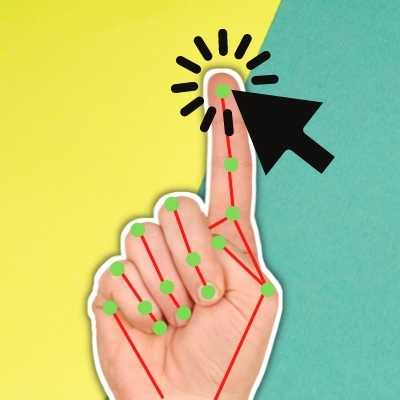

# OpenCV_VirtualMouseControlerWithHandGestures
An AI based Virtual mouse pointer controler using your hand gestures performing every task a mouse perform.

-----------------------------------------------------------------------------------------------------------------------

Steps for installation ::

1. Install an editor or IDE for python eg pycharm
2. ADD packages openCV-python , mediapipe , nymphy.
3. Import Hand gesture Module 
4. Run the Virtual MOuse Module and enjoy your Virtual mouse .

_________________________________________________________________________________________________________________________

